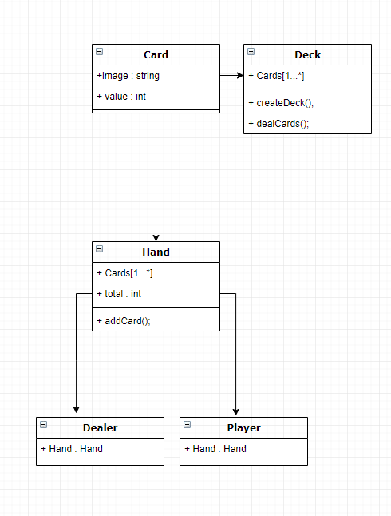

# Blackjack.JS (29-02-2020)

The Project Blackjack.JS was made as a school project at EUC SYD Sønderborg.
It's a website to play blackjack on.
# Files Structure
* index.html
* app.js

## Methods

### app.js
* function createDeck();
* function dealCards();
* function addCard();
* function calculateTotal();
* function checkWinningCondition();
* function Hit();
* function Stand();
* function playgroundUpdate();
* function initiatePlayground();
* function Restart();
* function Game();

## Installation
1. Add the app.js and css to your website
2. add  to your head and add the html code to your html page

## ER Diagram

 ## Creators
 - kevin Pike Darmer 
